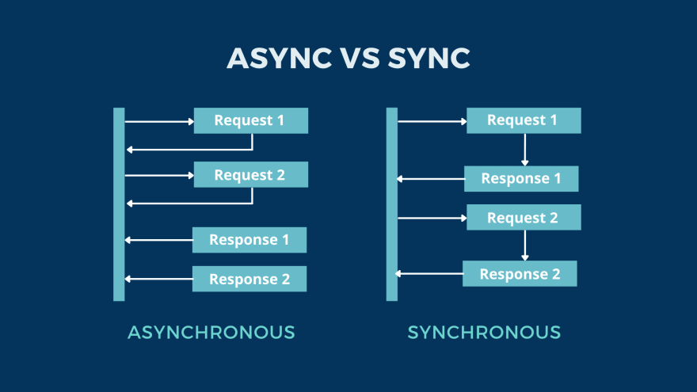

# Asynchrone

L'Asynchrone est une approche de programmation ui permet d'exécuter des tâches sans bloquer le fil principal d'exécution (qu'on apelle thread ou thread principal).
A L'inverse de l'approche Synchrone ou chaque requête doit terminer son exécution, l'asynchrone permet d'enchaîner plusieurs requêtes en même temps.

Asynchrone est une approche de programmaion, c'est à dire qu'on peut travailler en Asynchrone si on le souhaite, mais on peut aussi travailler en synchrone si on le souhaite.
On peut aussi mélanger le synchrone ET l'asynchrone (c'est même très commun de faire comme ça).