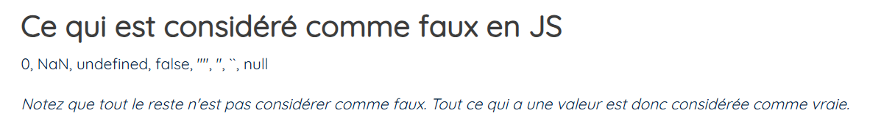

Pour vérifier si une valeur et fausse en js :


Si une valeur est égal à :
- 0
- NaN
- undefined
- false
- ""
- ''
- ``
- null

Et bien cette valeur sera considéré comme fausse.

```javascript
// Ici on définit notre booléen isLoading2 egal à true
// isLoading2 n'est pas considéré comme faux en js, car il est égal à true (True = 1)
let isLoading2 = true;

if (isLoading2) { // Ici je vérifie si isLoading2 est vrai
    // Si isLoading2 est vrai, on rentre dans le if et on affiche "Data is loading"
    console.log("Data is loading")
} else { // Sinon, si isLoading2 est faux, on rentre dans le else
    // Et on affiche "Data is done!"
    console.log("Data is done!")
}
```

## L'équivalent en ternaire

Pour effectuer ce if en ternaire voilà comment ça se passe :
```javascript
let isLoading = true; // On créer un booleen nommé isLoading égal à true 

// Ici on créer une constante message qui a pour valeur une string
// message sera égal à => `Data is loading...` seulement si isLoading n'est pas considéré comme faux en javascript
// Par contre message sera égal à => `Data is done!` si isLoading est considéré comme faux en javascript (voir le cours valeur_fausse.md)
// Apres le '?' => c'est l'équivalent de si le if est respecté => ici on affiche loading...
// Apres le ':' => c'est l'équivalent de si le if n'est respecté (else) => ici on affiche loading...
const message = `Data is ${isLoading ? 'loading...' : 'done!'}`;
```

Et cette ternaire se traduit exactement de la cette façon avec des if :
```javascript
let isLoading = true;

if (isLoading) {
    const message = "Data is loading"
} else {
    const message = "Data is done!"
}
```