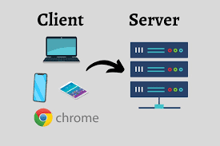

# Protocoles

# Introduction

En informatique, pour que 2 outils communiquent entre eux, ils vont utiliser ce qu'on apelle un "protocole de communication".

Protocole de communication => Un moyen pour 2 outils informatique de communiquer (tout simplement)

Il existe plusieurs types de protocoles de communications, par exemples :
- TCP/IP
- FTP/FTPS
- SNMP
- HTTP/HTTPS (celui qu'on va retenir pour aujourd'hui)

## Le protocole HTTP/HTTPS

Le protocole HTTP est un protocole de communication qui permet de faire communiquer un lient avec un serveur.

### C'est quoi un client ?

Le client c'est vous lorsque vous utilisez un site web ou une api web, ou tout simplement quelque chose qui est stocké sur le web.

Quand vous utilisez un site web, via internet, le client c'est votre navigateur web (google chrome, firefox, etc).

### Et un serveur c'est quoi ?

un serveur c'est tout simplement une machine qui est distante. On lui donne l'apellation de "serveur" car elle n'est pas physique, on s'y connecte à distance.

### Et c'est qui le serveur dans le protocole HTTP ?

Et bien c'est tout simplement la machine qui stock le site sur lequel on veut effectuer nos requêtes.



### Et le protocole HTTP dans tout ça ?

C'est un protocole qui permet au client (nous) de communiquer avvec un serveur (la où le site est stocké).
Le protocle marche comme ça :
1. Le client fait une requête HTTP vers le serveur demandé
2. Le serveur intercepte la requête
3. Le serveur envoie une réponse au client qui a fait la requête
4. Le client intercepte la réponse.

#### Exemple de communication HTTP basique
On veut aller sur le site de 3WAcademy :
1. On va effectuer une requête HTTP vers cette url : `https://3wacademy.fr/`

2. Le serveur où le site de 3Wacademy est stocké vient d'intercepter la requête
3. Le serveur où est stocké le site 3Wacademy envoie une réponse
4. On intercepte la réponse


Ici la réponse du serveur où est stocké `https://3wacademy.fr/` c'est non seulement le HTML, mais c'est aussi TOUTES LES RESSOURCES NECESSAIRES AU BON FONCTIONNEMENT DE LA PAGE WEB QUI EST RETOURNE, soit le HTML, le CSS, le Javascript, les images, les vidéos (s'il y en a), et toutes les ressources nécéssaires à cette page web.

## Et les API Web, comment ça fonctionne ?

Et bien c'est exactement le même fonctionnement que pour un site web classique comme vu précédemment, mais la réponse d'une API WEB sera différente. C'est à dire que ça marche exactement comme quand on utilise un site web, sauf qu'ici la réponse d'une API Web sera au format JSON.
Les étapes pour communiquer avec une API WEB sont exactement les mêmes que lorsqu'on communique avec un site web, sauf qu'il n'y a que la réponse qui change, elle aura ce genre de format (JSON) :

```js
1 : {
        userId: 1, 
        id: 1, 
        title: 'sunt aut facere repellat provident occaecati excepturi optio reprehenderit', 
        body: 'quia et suscipit\nsuscipit recusandae consequuntur …strum rerum est autem sunt rem eveniet architecto'
    },
2 : {
        userId: 1, 
        id: 2, 
        title: 'qui est esse', 
        body: 'est rerum tempore vitae\nsequi sint nihil reprehend…aperiam non debitis possimus qui neque nisi nulla'
    },
3 : {
        userId: 1, 
        id: 3, 
        title: 'ea molestias quasi exercitationem repellat qui ipsa sit aut', 
        body: 'et iusto sed quo iure\nvoluptatem occaecati omnis e…\nmolestiae porro eius odio et labore et velit aut'
    }
4 : {
        userId: 1, 
        id: 4, 
        title: 'eum et est occaecati', 
        body: 'ullam et saepe reiciendis voluptatem adipisci\nsit … ipsam iure\nquis sunt voluptatem rerum illo velit'
    }
5 : {
        userId: 1, 
        id: 5, 
        title: 'nesciunt quas odio', 
        body: 'repudiandae veniam quaerat sunt sed\nalias aut fugi…sse voluptatibus quis\nest aut tenetur dolor neque'
    }
```

### C'est quoi du JSON ?

Et bien du JSON, litéralement l'abréviation de JavaScript Object Notation, c'est tout simplement des objets Javascript. Ca a le même format que ça :
```javascript
// Simple objet Javascript
const objet = {
    prenom : "imed",
    ville : "Paris",
    pays : "France",
    cp : 75000
}
```